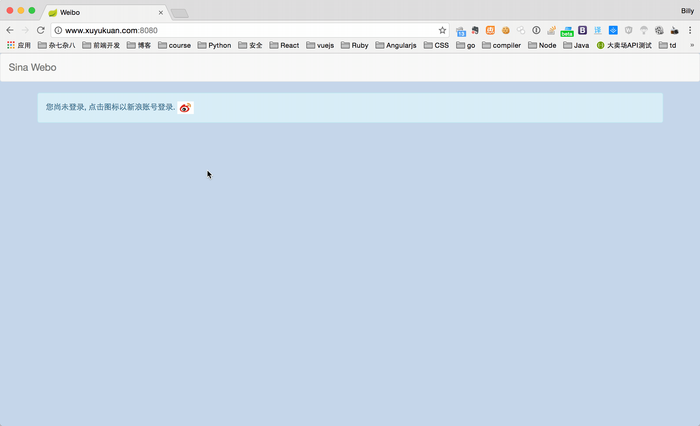

# xzdemo
###Demo###

###Dockhub###
Dockerhub: [https://hub.docker.com/r/xuyukuan/xzdemo/](https://hub.docker.com/r/xuyukuan/xzdemo/)  
Run steps:  
> 1. sudo sh -c "echo '127.0.0.1    www.xuyukuan.com' >> /etc/hosts"  
2. docker run -ti -p 8080:8080 xuyukuan/xzdemo:1.0-SNAPSHOT

###Comment:  ###
Problem 1: I try the public timeline api, but always got not data when I pass parameter page > 1, so I change to home timeline api to demonstrate the test result.  
Problem 2: Sina api has access limit to uncertified apps, so if test many times, it will reach the limit and get forbidden error.  
Problem 3: To get this app running, need to modify the /etc/hosts file, add a new line "127.0.0.1     www.xuyukuan.com"  at the end of the file. I also tried docker --add-host, but it doesn't work. so I'm afraid this need to config manually.  

